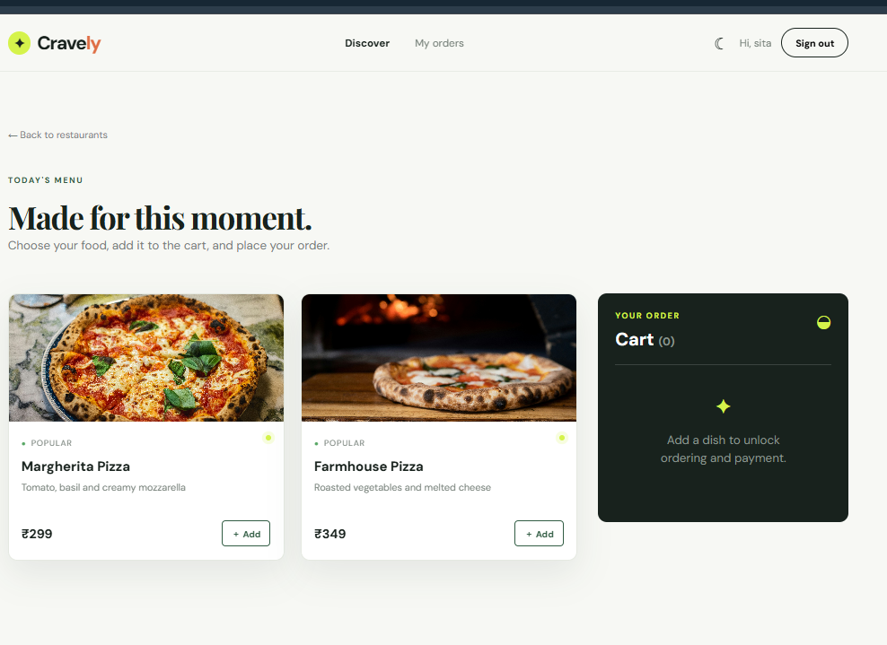

# Cravely Online Food Ordering System

Cravely is a full-stack online food ordering application inspired by modern delivery platforms such as Zomato and Swiggy. Customers can discover restaurants, browse image-rich menus, filter cuisines, manage a cart, place orders, choose a payment method, track order details, and cancel eligible orders.




## Highlights

- Modern React interface with responsive desktop and mobile layouts
- Fixed navigation available across every page
- Cravely branding with food photography and animated interactions
- Restaurant discovery with search and cuisine filters
- Indian, Pizza, Healthy, and Desserts restaurant collections
- Menu items with images, descriptions, prices, and availability
- Cart with quantity controls, item total, delivery fee, and final total
- Customer registration and JWT-based sign in
- Dark mode with persisted user preference
- Checkout with delivery address and payment selection
- Cash on delivery and demo test payment modes
- Order history with restaurant, food items, quantities, images, date, payment, and status
- Customer cancellation for orders that are still `PLACED` or `CONFIRMED`
- MySQL persistence through Spring Data JPA
- Admin endpoints for restaurant, menu, and order management

## Technology Stack

### Frontend

- React 18
- React Router
- Axios
- Vite
- CSS animations and responsive styling

### Backend

- Java 17+
- Spring Boot 3.3
- Spring Web
- Spring Data JPA
- Spring Security
- JWT authentication
- Lombok
- Maven

### Database

- MySQL 8+

## Project Structure

```text
online-food-ordering-system/
├── backend/
│   ├── pom.xml
│   └── src/main/
│       ├── java/com/foodapp/
│       │   ├── controller/
│       │   ├── model/
│       │   ├── repository/
│       │   └── security/
│       └── resources/application.properties
├── frontend/
│   ├── package.json
│   └── src/
│       ├── api.js
│       ├── App.jsx
│       ├── main.jsx
│       └── style.css
└── docs/screenshots/
```

## Requirements

Install these before running the project:

- JDK 17 or newer
- Maven 3.9+
- Node.js 18+
- npm
- MySQL 8+

Check your installations:

```powershell
java -version
mvn -version
node --version
npm --version
```

## Database Setup

Start MySQL and create the database:

```sql
CREATE DATABASE food_ordering_db;
```

Open:

```text
backend/src/main/resources/application.properties
```

Update the database username and password for your machine:

```properties
spring.datasource.username=root
spring.datasource.password=your_mysql_password
```

The application uses this local connection configuration:

```properties
spring.datasource.url=jdbc:mysql://localhost:3306/food_ordering_db?createDatabaseIfNotExist=true&useSSL=false&allowPublicKeyRetrieval=true&serverTimezone=Asia/Kolkata
```

The backend automatically creates or updates tables with Hibernate and seeds restaurants and menu items for Indian, Pizza, Healthy, and Desserts categories.

## Run the Application

Open two terminals from the project root:

### Terminal 1: Backend

```powershell
cd backend
mvn spring-boot:run
```

Backend URL:

```text
http://localhost:8080
```

### Terminal 2: Frontend

```powershell
cd frontend
npm install
npm run dev
```

Frontend URL:

```text
http://localhost:5173
```

Important: run npm commands inside `frontend`, because the `package.json` file is located there.

## Customer Flow

1. Open `http://localhost:5173`.
2. Select a restaurant or choose a cuisine filter.
3. Open the restaurant menu.
4. Add food items to the cart.
5. Adjust quantities and click `Order & pay`.
6. Enter a delivery address.
7. Choose `Cash on delivery` or `Test payment`.
8. Place the order.
9. Open `My orders` to see the stored order details.
10. Cancel the order while its status is `PLACED` or `CONFIRMED`.

## API Reference

Base URL: `http://localhost:8080/api`

### Public endpoints

| Method | Endpoint | Purpose |
|---|---|---|
| `POST` | `/auth/register` | Create a customer account |
| `POST` | `/auth/login` | Sign in and receive a JWT |
| `GET` | `/restaurants` | List active restaurants |
| `GET` | `/restaurants/{id}/menu` | List available menu items |

### Authenticated endpoints

| Method | Endpoint | Purpose |
|---|---|---|
| `POST` | `/orders` | Create an order |
| `GET` | `/orders/my` | Load the signed-in customer's order history |
| `GET` | `/orders/{id}` | Load one customer's order |
| `POST` | `/orders/{id}/cancel` | Cancel an eligible customer order |

Send the JWT token in the request header:

```text
Authorization: Bearer <token>
```

## Payment Modes

The checkout currently supports two working demo modes:

- `COD`: Cash on delivery. Payment status is stored as `PENDING`.
- `TEST`: Simulated successful payment. Payment status is stored as `PAID`.

For production, replace the test flow with a verified payment gateway integration and signature validation.

## Demo Admin

Register an account normally, then promote it for local development:

```sql
UPDATE users SET role='ADMIN' WHERE email='admin@example.com';
```

Admin routes are protected by the `ADMIN` role.

## Troubleshooting

### `Could not load orders`

1. Confirm the backend terminal shows `Tomcat started on port 8080`.
2. Confirm MySQL is running.
3. Confirm the username and password in `application.properties`.
4. Sign in again to refresh the JWT token.
5. Open the frontend from `http://localhost:5173`, not a different port.

### `Public Key Retrieval is not allowed`

The JDBC URL must include:

```text
allowPublicKeyRetrieval=true
```

Restart Spring Boot after changing `application.properties`.

### `Menu is unavailable`

Restart the backend so the data seeder can create the restaurant and menu records. Confirm that this endpoint responds:

```text
http://localhost:8080/api/restaurants
```

### npm cannot find `package.json`

Use the nested frontend directory:

```powershell
cd C:\Users\delll\Downloads\online-food-ordering-system\online-food-ordering-system\frontend
npm run dev
```

## Production Checklist

Before deploying this project publicly:

- Move database credentials and JWT secrets to environment variables.
- Use HTTPS for frontend and backend traffic.
- Add request validation and rate limiting.
- Add verified payment signature handling.
- Store uploaded images in object storage instead of external URLs.
- Add stock management and transactional order validation.
- Add automated tests for authentication, cart totals, checkout, and cancellation.
- Configure production CORS origins instead of localhost.
- Disable development credentials and generated Spring security passwords.

## License

This project is intended for learning, demonstration, and college project use.
